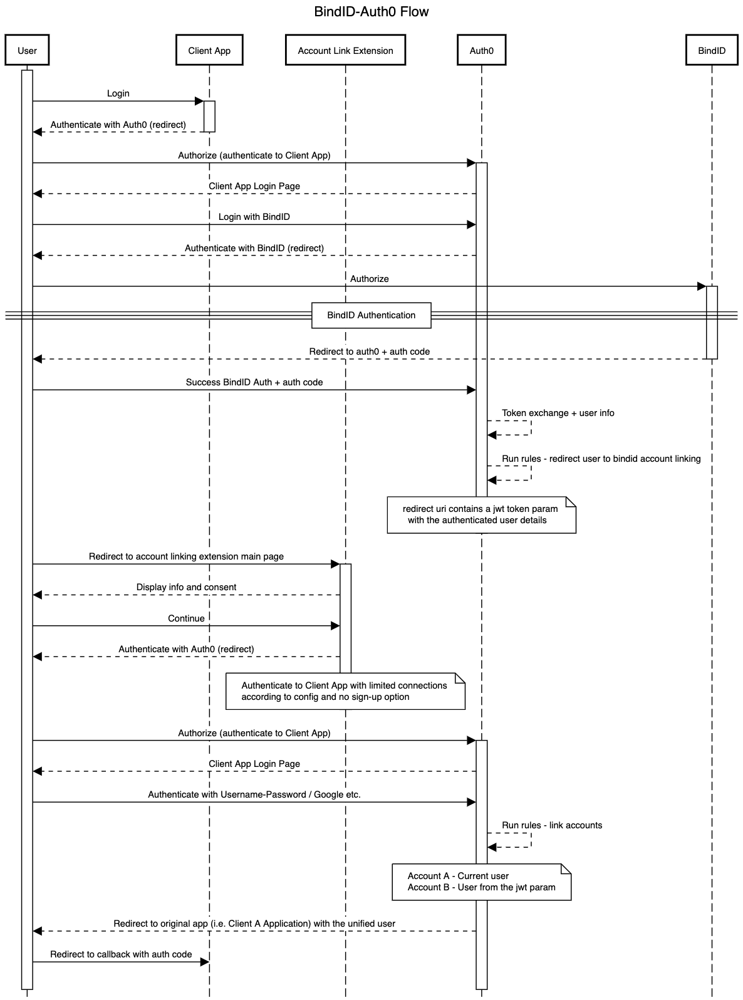

# Auth0 Account Link Extension

This extension provides a rule and interface for enabling users the option of linking a new BindID account
with an existing auth0 account.

> **NOTE:** Please make sure you are using your own social connections (Google, Facebook, etc...) API keys. Using Auth0's keys will result on an 'Unauthorized' error on account linking skip.

## Account Linking Flow



** created with https://sequencediagram.org/
## Running in Development

Update/Create the configuration file under `./server/config.json`:

```json
{
  "EXTENSION_SECRET": "mysecret",
  "AUTH0_DOMAIN": "me.auth0.com",
  "AUTH0_CLIENT_ID": "myclientid",
  "AUTH0_CLIENT_SECRET": "myclientsecret",
  "WT_URL": "http://localhost:3000",
  "AUTH0_CALLBACK_URL": "http://localhost:3000/callback"
}
```

#### Example

```json
{
  "EXTENSION_SECRET": "d2h8f03wghjti404-gjfeqihu0cre",
  "AUTH0_DOMAIN": "dev-iiazsytr.us.auth0.com",
  "AUTH0_CLIENT_ID": "U62nbDAvjevqj63HJzPQD0NxUhfZv3g8",
  "AUTH0_CLIENT_SECRET": "Lv6h8CfiLkLqbrDfQMz3dfcY2Gk30SHVG5BaJo-RLB42xoJeSe3PEuazfs-6UacC",
  "WT_URL": "http://localhost:3000",
  "AUTH0_CALLBACK_URL": "http://localhost:3000/callback",
  "AUTH0_RTA": "dev-iiazsytr.us.auth0.com"
}

```

Then you can run the extension:

```bash
nvm use
npm install
npm run build
npm run serve:dev
```

## Auth0 Configurations

### Configuring Linkable Connections

1. Open Auth0 management console
2. Go to **Rules** sub-menu
3. Define the following key-values under the **Settings** section:
   
| Key  	| Description | example
|---	|---	|---	|	
|  `bindid_connection` 	| The name of the your bindid connection used to detect bindid logins in order to suggest account linking  	|  `bindid-idp` 	|   	
|  `linkable_connections` 	|  A comma-seperated (no spaces) list of connection names that will be considered eligible for account linking, when performing the BindID account linking only those options will be available for the user. 	|  `Username-Password-Authentication,google-oauth2`  	|  

### Update Universal Login Page

In order to limit the allowed connections in the account linking and disable sign-up, add the following to your universal login page config (found **Universal Login->Login Tab**):

1. Define the allowed connections at the start of the script:
```js 
...
var allowedConnections = config.extraParams.allowed_connections || "";
...
```
2. Add the following field to the `Auth0Lock` options:
```js
...
allowedConnections: allowedConnections ? allowedConnections.split(',') : null,
...
```
3. In order to disable Sign-up availability as part of the account linking, add the following field to the `Auth0Lock` options:
```js
...
allowSignUp: !config.extraParams.prevent_sign_up,
...
```

## Running puppeteer tests

In order to run the tests you'll have to [start the extension server locally](https://github.com/auth0-extensions/auth0-account-link-extension#running-in-development), fill the `config.test.json` file (normally with the same data as the `config.json` file) and run the Sample Test application located in `sample-app/` (create a dedicated client for this app).

Then, you can run the tests running:
```bash
yarn test
```
